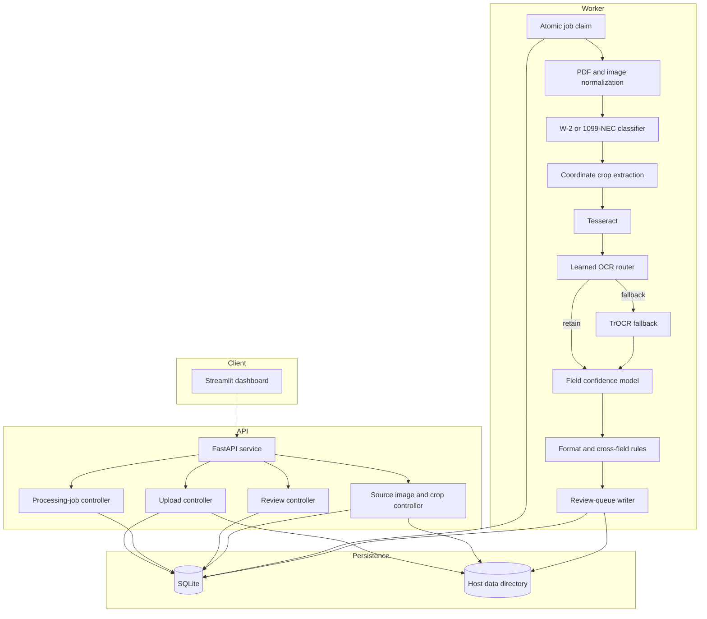
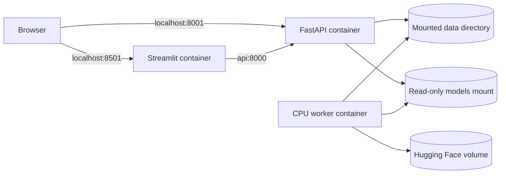

# DocIntelAI Architecture

## System goals

DocIntelAI is designed to demonstrate an end-to-end document intelligence workflow rather than a standalone OCR notebook.

The system must accept documents, classify them, extract field-level values, estimate correctness, apply deterministic validation, route uncertain fields to human review, preserve reviewer decisions, expose the workflow through APIs and a dashboard, and run locally or through Docker.

## High-level components



## Upload lifecycle

1. A reviewer uploads a PNG, JPG, or PDF.
2. FastAPI validates file type and size.
3. The file is hashed with SHA-256.
4. Duplicate uploads are blocked unless deliberate reprocessing is enabled.
5. The upload is stored under the mounted data directory.
6. A queued processing-job row is created in SQLite.
7. The background worker claims the oldest queued job.

## Worker lifecycle

### Job claiming

The worker uses atomic job claiming to prevent two workers from processing the same job.

```text
queued → processing → completed
```

Failures can be retried and historical jobs can be archived without deleting their records.

### Document normalization

Images are converted to RGB. PDFs are rendered into page images. The normalized source image is saved for reviewer verification.

### Classification and crops

The worker identifies W-2 or 1099-NEC and maps template field regions to pixel coordinates. The same coordinates power both OCR crops and reviewer highlighting.

### Hybrid OCR

Tesseract produces the first candidate. A learned router decides whether TrOCR fallback is likely to help. The selected OCR value is passed to the confidence model.

### Confidence and validation

The field-confidence model combines OCR and field characteristics. Deterministic checks then evaluate identifiers, state codes, ZIP codes, numeric formatting, required fields, and cross-field tax consistency.

### Review policy

Fields are grouped into critical, structured, and descriptive risk tiers. Critical fields use the highest acceptance threshold.

Field states:

```text
accepted
pending
approved
corrected
```

Document states:

```text
pending
in_progress
ready_for_completion
completed
```

## Persistence model

### review_documents

Stores document-level workflow state, priority, field counts, exceptions, reviewer assignment, and completion state.

### review_fields

Stores OCR values, engine, risk tier, correctness probability, thresholds, validation results, review reason, corrected value, reviewer, and timestamps.

### review_events

Stores append-only reviewer actions such as assignment, approval, correction, and completion.

### document_uploads

Stores filename, MIME type, SHA-256, path, size, and upload state.

### processing_jobs

Stores asynchronous status, stage, progress, detected type, result document ID, failure information, and timestamps.

### document_media

Maps each review document to its source image, annotation metadata, and field crop coordinates.

## API and UI separation

Streamlit communicates with FastAPI instead of reading SQLite directly. This provides clearer boundaries, better testability, and an easier future migration to another frontend or database.

## Docker topology



The worker is CPU-only in Docker for predictable behavior and to avoid CUDA-memory failures.

## Testing strategy

The integration suite creates a temporary project root, SQLite database, media files, and upload folder. It verifies health, statistics, retrieval, assignment, approval, correction, completion rules, audit history, uploads, duplicate protection, job tracking, retry and archive behavior, media endpoints, and persistence.

## Security boundary

The current implementation is appropriate for a portfolio demonstration using synthetic data. A real deployment would require authentication, authorization, encryption, secret management, malware scanning, retention controls, PII masking, secure object storage, managed database backups, and incident monitoring.

## Design tradeoffs

SQLite was chosen for reproducibility and low operational overhead. Coordinate extraction was chosen for explainability and direct reviewer traceability. Human review is mandatory because exact OCR accuracy is not sufficient for autonomous tax processing.
